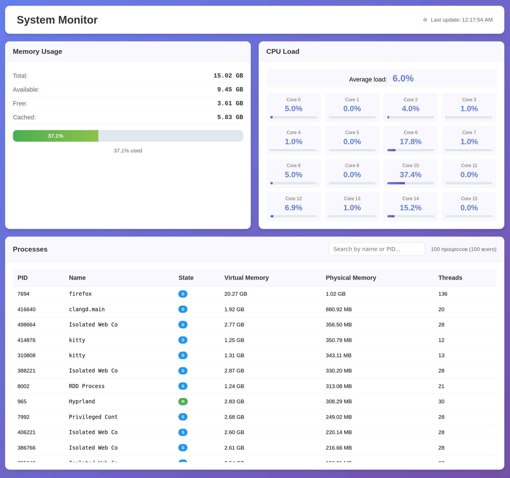

# mtop - Linux System Monitor

[](https://isocpp.org/)
[](https://www.typescriptlang.org/)



mtop - это веб-ориентированный системный монитор для Linux, предоставляющий информацию о памяти, загрузке CPU и запущенных процессах в реальном времени через веб-интерфейс.

## Возможности

- **Мониторинг памяти** - отображение общей, доступной, свободной и кэшированной памяти с графическим индикатором
- **Мониторинг CPU** - отображение загрузки каждого ядра процессора в реальном времени
- **Список процессов** - таблица процессов с информацией о PID, имени, состоянии, виртуальной и физической памяти, количестве потоков
- **Поиск процессов** - фильтрация по имени процесса или PID
- **Сортировка** - сортировка таблицы процессов по любому столбцу (клик по заголовку)
- **Автообновление** - данные динамически обновляются
- **REST API** - доступ к метрикам через JSON API

## Особенности реализации

- C++14
- httplib - легковесная библиотека для HTTP-сервера
- Чтение системной информации из `/proc`
- Мьютексы
- frontend: HTML, CSS, TypeScript

## Установка и сборка

### Требования

- CMake (>= 3.10)
- C++ компилятор с поддержкой C++14
- Node.js (для компиляции TypeScript)

### Сборка C++ сервера

```bash
# Клонирование репозитория
git clone https://github.com/AlexeyL54/mtop.git
cd mtop

# Создание директории для сборки
mkdir build
 
cp -r web build/
 
cd build

cmake ..

make

./mtop
```

### Компиляция TypeScript (опционально)

Если вы изменили `script.ts`, скомпилируйте его в JavaScript:

```bash
npm install

# Компиляция
npx tsc

rm -rf build/web

cp -r web build/
```

## Запуск

### Базовый запуск

```bash
./build/mtop
```

Сервер запустится на порту 8080. Откройте браузер и перейдите по адресу:
```
http://localhost:8080
```

### Параметры командной строки

```bash
./build/mtop -p <port> -d <web-directory>
```

- `-p <port>` - указать порт (по умолчанию: 8080)
- `-d <dir>` - указать директорию с веб-файлами (по умолчанию: ./web)
- `-h` - показать справку

#### Примеры:

```bash
# Запуск на порту 3000
./build/mtop -p 3000

# Запуск с пользовательской директорией веб-файлов
./build/mtop -d ./web

# Комбинация параметров
./build/mtop -p 9090 -d ./web
```

## Использование

### Веб-интерфейс

1. **Просмотр метрик** - карточки памяти и CPU отображают основные системные показатели
2. **Загрузка CPU** - для каждого ядра отображается процент загрузки и графическая шкала
3. **Поиск процессов** - введите имя процесса или PID в поле поиска для фильтрации
4. **Сортировка** - кликните по заголовку столбца для сортировки процессов
5. **Автообновление** - данные автоматически обновляются

### Интерпретация состояния процессов

| Состояние | Описание |
|-----------|----------|
| **R** | Выполняется (running) |
| **S** | Ожидание (sleeping) |
| **D** | Непрерываемое ожидание (uninterruptible sleep) |
| **Z** | Зомби (zombie) |
| **T** | Остановлен (traced/stopped) |

## Структура проекта

```
mtop/
├── src/                 
│   ├── httplib.h          # HTTP библиотека
│   ├── Monitor.hpp        # Класс мониторинга системы
│   ├── Monitor.cpp
│   ├── MonitorServer.hpp  # HTTP сервер
│   └── MonitorServer.cpp
├── web/                   # Фронтенд файлы
│   ├── index.html         # Главная страница
│   ├── styles.css         # Стили
│   ├── script.ts          # TypeScript исходник
│   └── script.js          # Скомпилированный JavaScript
├── main.cpp               # Точка входа
├── CMakeLists.txt         # CMake конфигурация
├── tsconfig.json          # TypeScript конфигурация
├── package.json           # Node.js зависимости
└── README.md              # Этот файл
```

**Примечание**: Проект работает только на Linux из-за использования файловой системы `/proc`.
